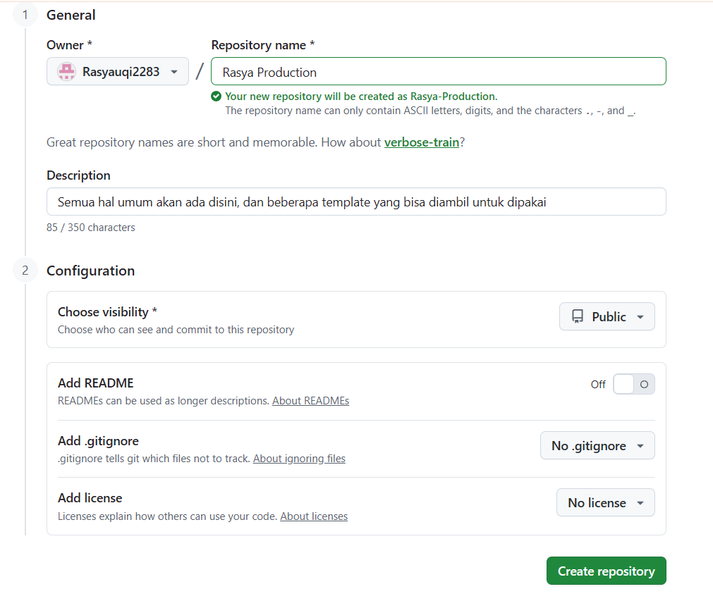

# Cara Upload rasya-production ke GitHub (Langkah Lengkap)

Panduan ini untuk yang belum pernah pakai Personal Access Token. Ada **dua cara** push ke GitHub.

---

## Yang sudah selesai

- Folder `rasya-production` sudah di-commit di komputer Anda.
- Tinggal **push** ke GitHub setelah repo dibuat.

---

## Bagian 1 — Buat repo di GitHub



1. Buka browser, masuk ke: **https://github.com/new**
2. Kalau belum login, login dulu dengan akun **Rasyauqi2283**.
3. Isi:
   - **Repository name:** ketik persis: `rasya-production`
   - **Public** (pilih yang ini)
   - **Jangan centang** "Add a README file", "Add .gitignore", atau "Choose a license" (biarkan kosong).
4. Klik **Create repository**.
5. Nanti muncul halaman repo kosong. **Jangan isi apa-apa.** Tutup saja; kita lanjut di komputer.

---

## Bagian 2 — Push dari komputer

Buka **PowerShell** atau **Git Bash**, lalu jalankan:

```powershell
cd "c:\Users\USER\Downloads\Rasya\rasya-production"
& "C:\Program Files\Git\bin\git.exe" push -u origin main
```

*(Kalau Anda sudah tambah Git ke PATH, cukup: `git push -u origin main`.)*

---

## Bagian 3 — Login saat push (pilih salah satu)

Saat perintah `push` di atas dijalankan, kadang muncul permintaan login.

### Opsi A — Login lewat browser (paling gampang)

Banyak komputer yang sudah pakai **Git Credential Manager**. Saat push:

1. Bisa muncul jendela kecil atau perintah di terminal minta login.
2. Pilih opsi **"Sign in with your browser"** atau **"Login with browser"**.
3. Browser akan terbuka → login ke GitHub (Rasyauqi2283) seperti biasa.
4. Setelah berhasil di browser, kembali ke PowerShell/Git Bash dan push akan jalan.

**Kalau tidak ada opsi browser**, pakai Opsi B (token).

---

### Opsi B — Pakai Personal Access Token (kalau diminta password)

GitHub tidak lagi mengizinkan pakai **password akun** untuk push dari aplikasi/terminal. Yang dipakai adalah **Personal Access Token** (singkatnya: token = “password khusus untuk Git”).

#### Apa itu token?

- Semacam **password sekali buat** yang dipakai khusus untuk Git (push/pull).
- Anda buat di website GitHub, lalu saat terminal minta “password”, Anda paste **token** itu (bukan password GitHub).

#### Cara buat token (sekali saja)

1. Login ke **https://github.com** (akun Rasyauqi2283).
2. Klik **foto profil** (pojok kanan atas) → **Settings**.
3. Di menu kiri bawah, klik **Developer settings**.
4. Klik **Personal access tokens** → **Tokens (classic)**.
5. Klik **Generate new token** → **Generate new token (classic)**.
6. Isi:
   - **Note:** isi bebas, misalnya: `rasya-production`
   - **Expiration:** pilih berapa lama (misalnya 90 days atau No expiration).
   - Centang **repo** (agar token bisa push/pull ke repo).
7. Klik **Generate token**.
8. **Copy token** yang muncul (deret huruf/angka). Token hanya muncul sekali; kalau hilang, harus buat baru.
9. Simpan token di tempat aman (misalnya notepad sementara) — jangan share ke orang.

#### Cara pakai token saat push

1. Jalankan lagi:
   ```powershell
   cd "c:\Users\USER\Downloads\Rasya\rasya-production"
   & "C:\Program Files\Git\bin\git.exe" push -u origin main
   ```
2. Saat diminta:
   - **Username:** ketik `Rasyauqi2283`
   - **Password:** **paste token** yang tadi Anda copy (bukan password GitHub).
3. Enter → push akan jalan.

Setelah itu, Windows/Git bisa menyimpan credential sehingga push berikutnya tidak selalu minta token lagi.

---

## Cek hasil

Setelah push sukses, buka di browser:

**https://github.com/Rasyauqi2283/rasya-production**

Semua file proyek (frontend, backend, dsb.) akan tampil di sana.

---

## Ringkasan singkat

| Langkah | Yang dilakukan |
|--------|-----------------|
| 1 | Buat repo kosong `rasya-production` di https://github.com/new |
| 2 | Di komputer: `cd` ke folder rasya-production, lalu `git push -u origin main` |
| 3 | Kalau muncul login: coba **login lewat browser** dulu; kalau tidak ada, pakai **Personal Access Token** seperti di Opsi B |

Kalau ada pesan error saat push, salin teks errornya dan kirim—nanti bisa dibantu langkah perbaikannya.
